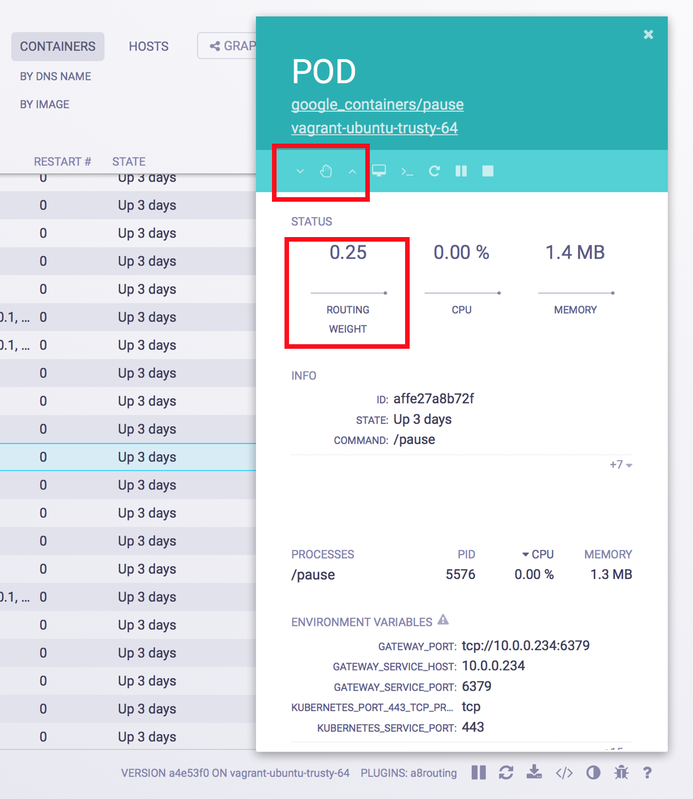

# Amalgam8 Route Control WeaveScope Plugin

The Route Control plugin allows the user to modify the existing routing weight of a service from one of its running containers. The following images show a simple example of how **status** and **controls** are displayed in scope UI.

## Visualization

The routing weight is shown under status in a field named **Routing Weight**. 

## Controls

The Route Control plugin provides a simple interface to change the value of the routing weight (arrow buttons), or to clear the routing rules for the service.

The *arrow* buttons control the routing weight value, in increments/decrements of 
The *hand* button clears all routing rules.