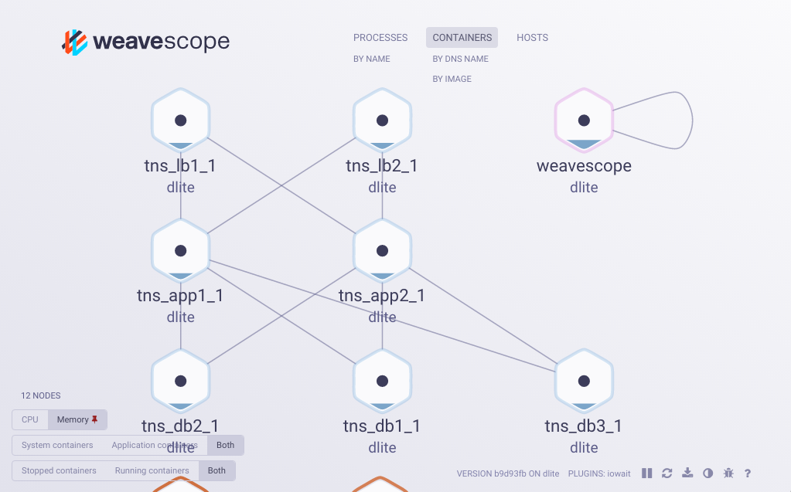

### What Weave Scope Is
Weave Scope is a tool for monitoring, visualization & management for Docker & Kubernetes. It allows you to interact with your containers in addition to visualizing how they interact with each other in real-time. 

# Amalgam8 Route Control Plugin for Weave Scope

The Route Control plugin allows the user to modify the existing routing weight of a service from one of its running containers. The following images show a simple example of how **status** and **controls** are displayed in scope UI.

## Visualization

The routing weight is shown under status in a field named **Routing Weight**. 

## Controls

The Route Control plugin provides a simple interface to change the value of the routing weight (arrow buttons), or to clear the routing rules for the service.

The *arrow* buttons control the routing weight value, in increments/decrements of 0.1  
The *trash can* button clears all routing rules.

## Prerequisites

You must have Weave Scope installed and running. You can find the instructions on how to do so here: https://github.com/weaveworks/scope#getting-started

## Installing the Amalgam8 Route Control Plugin

* Use *make* to build and run.  
* Use *make clean* to remove the image.